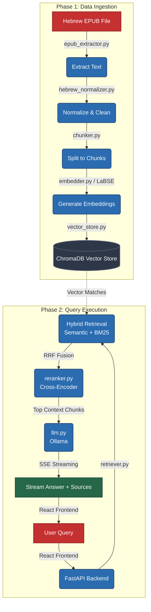

# Hebrew RAG System: Complete Architecture Flow

This document outlines the complete flow of the Hebrew RAG (Retrieval-Augmented Generation) project. It is divided into two main phases: **Data Ingestion** (preparing the data) and **Query Execution** (handling user questions).

## Architecture Flowchart

## 1. Data Ingestion Flow (Processing the EPUB)
This process converts the raw Hebrew EPUB book into searchable vector embeddings.

1. **EPUB Extraction**: The `epub_extractor.py` reads the Hebrew EPUB file (e.g., `data/atalefim.epub`) and parses it into structured chapters and text using `ebooklib` and `BeautifulSoup4`.
2. **Text Normalization**: The text is passed through `hebrew_normalizer.py`, which cleans up the Hebrew text by handling Unicode NFC normalization, fixing RTL (Right-to-Left) issues, and removing nikud (vowel points) to ensure consistent searchability.
3. **Chunking**: The cleaned text is processed by `chunker.py`, which intelligently splits the chapters into smaller, overlapping segments (approximately 300 tokens each with a 50-token overlap). This ensures context isn't lost at the boundaries of the chunks.
4. **Embedding Generation**: The chunks are sent to `embedder.py`, which uses the `sentence-transformers/LaBSE` model to convert the Hebrew text into dense numerical vectors (embeddings) that capture their semantic meaning.
5. **Vector Storage**: Finally, `vector_store.py` saves both the raw text chunks and their corresponding embeddings into a persistent **ChromaDB** database.

## 2. Query Execution Flow (Answering Questions)
This process happens when a user submits a question through the frontend.

1. **User Input**: The user types a question in Hebrew into the React Frontend (`frontend-react`).
2. **API Request**: The frontend sends a POST request with the query to the FastAPI backend (`backend/main.py`).
3. **Hybrid Retrieval**: `retriever.py` takes the user's question and searches the ChromaDB database using a hybrid approach:
   - **Semantic Search**: Uses the LaBSE model to find chunks with similar meaning.
   - **Lexical Search (BM25)**: Uses keyword matching to find chunks containing the exact words.
   - The results from both methods are merged using **Reciprocal Rank Fusion (RRF)** to get a robust initial list of relevant chunks.
4. **Cross-Encoder Reranking**: To improve precision, `reranker.py` takes the initial list of chunks and uses a cross-encoder model (`cross-encoder/mmarco-mMiniLMv2`). It evaluates the exact relationship between the user's query and each chunk, re-scoring and re-ordering them to find the absolute best matches.
5. **LLM Generation**: The top-ranked chunks (usually the top 5) are gathered as context and passed to the `llm.py` module.
6. **Inference (Ollama)**: The prompt, which now contains the user's question and the relevant context chunks, is sent to a local **Ollama** instance running the `qwen2.5:14b-instruct` model.
7. **Streaming Response**: The LLM generates an answer in Hebrew. The backend streams this answer back to the frontend in real-time (using Server-Sent Events) along with the source chunks used to generate the answer, providing a smooth, ChatGPT-like experience in the UI.

> Note: This architecture ensures high accuracy for Hebrew text by combining semantic understanding, exact keyword matching, and advanced reranking before handing it off to the LLM for final answer generation.
